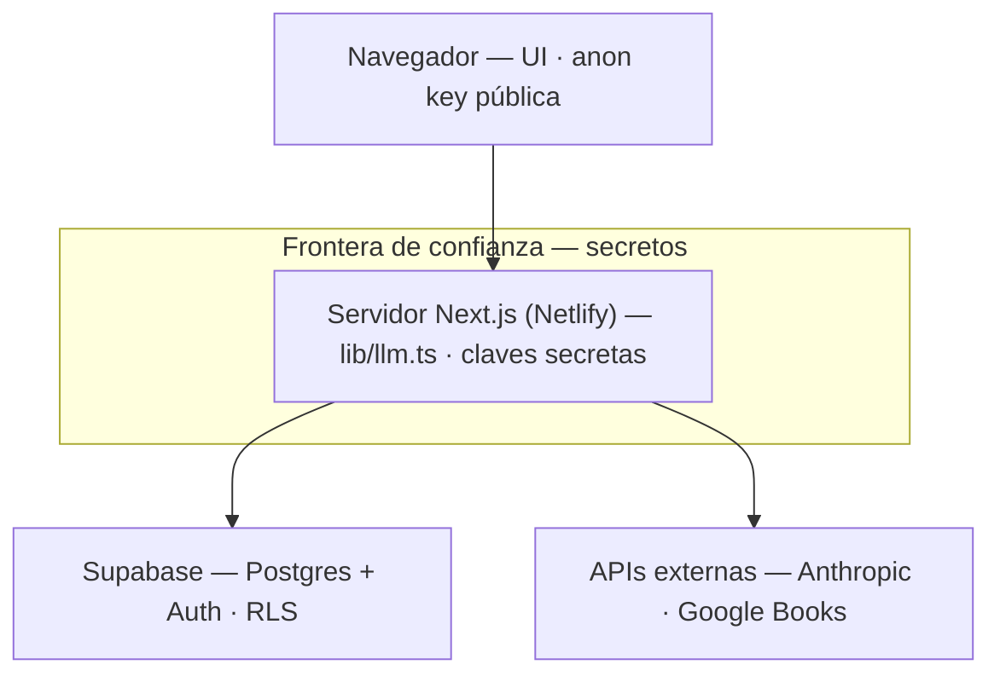
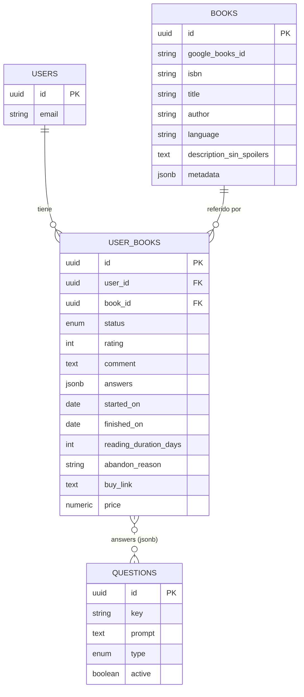

# Arquitectura — MyBooks

El porqué de cada decisión técnica. El *qué* está en `project-spec.md`, el *dónde* en `devlog.md`.

## Stack
Next.js (App Router) en Netlify, Supabase (Postgres + Auth + RLS), TypeScript + Tailwind, y una capa propia `lib/llm.ts` para hablar con el LLM (Claude Haiku por defecto, intercambiable). Se eligió Supabase por traer auth + RLS + (a futuro) realtime en una sola pieza, que es justo lo que pide el multiusuario y lo social de más adelante.

## Sistema: cómo viaja una request

Tres ideas que gobiernan todo:
- **El navegador no es de confianza.** Todo lo que llega ahí es público, así que solo lleva la *anon key*, que por sí sola no abre nada porque RLS la frena.
- **Los secretos viven solo en el servidor.** La service key de Supabase y la API key del LLM nunca salen al cliente; por eso las llamadas al LLM y a Google Books se hacen server-side.
- **RLS es el límite real.** Aunque algo se filtrara, Postgres responde solo las filas del usuario autenticado (`auth.uid() = user_id`).

## Modelo de datos

- **`books` es global** — una fila por edición, compartida por todos. La descripción sin spoilers y la metadata se generan/cachean una sola vez (más barato), y mañana un post o un like apuntan a ese libro.
- **`user_books` es la relación** usuario↔libro: tu estado, rating, comentario privado, respuestas, fechas, precio. Es la tabla con `user_id`, donde actúa RLS.
- **`answers` es `jsonb`** indexado por la `key` de cada pregunta: el cuestionario evoluciona sin migraciones.
- **`questions` es una tabla** (no código) para que las preguntas mejoren con el tiempo. El vínculo con `user_books` es blando (no hay FK; vive dentro del `jsonb`), por eso va punteado.
- **Idioma y dedup:** `language` resuelve obra-vs-edición (ES y EN son dos filas); `google_books_id`/`isbn` son la llave para no duplicar el mismo libro entre usuarios.
- **Fechas y duración:** `started_on`/`finished_on` se autocompletan al cambiar de estado; la duración se *calcula*, no se guarda. `reading_duration_days` es solo fallback para libros agregados de forma retroactiva.

## Decisiones difíciles de revertir
Multiusuario con RLS · Postgres real (Supabase) · libros globales + relación · respuestas en `jsonb` · LLM detrás de `lib/llm.ts`. El resto se deja emerger.

## Recomendaciones (v1)
Solo cuando el usuario las pide, a partir de una consulta en lenguaje natural ("no ficción, corta, sobre historia de la humanidad"). Se arma un contexto estructurado (libros leídos + respuestas + comentarios) y se le pasa al LLM, que devuelve sugerencias con su porqué. Cada sugerencia se **verifica contra Google Books**; las que no se confirman se descartan, para no mandar a buscar libros inexistentes. Se habilita desde **3 libros respondidos** (con menos, el LLM adivina a ciegas).

## Cuestionario
Mide lo que el rating no captura, separando *propiedades del libro* (ritmo, qué lo movía, densidad) de *la reacción del lector* (enganche, rereadability, recomendación), más un texto libre opcional. Es opcional, pero solo los libros respondidos alimentan las recomendaciones y cuentan para el gate. Las preguntas viven en `questions`; agregar o retirar preguntas no rompe datos viejos.

## Evolución (v2+)
Cada idea futura ya tiene su costura en el modelo; agregarla es extender, no rehacer.
- **Capa social (estilo Goodreads):** `posts` cuelga de `users` + `books`; `post_likes`, `post_comments` y `follows` cuelgan de ahí. Los likes son a los posts, no al libro directo. Requiere introducir un rol admin para moderación.
- **Recomendaciones semánticas:** una tabla/columna `book_embeddings` con `pgvector` en el mismo Postgres; retrieval por similitud antes del LLM (RAG). El texto libre del cuestionario es buen material para embeddear.
- **Precios automáticos:** scraping + jobs programados que actualizan `price`; hoy es manual.
- **Agrupar ediciones:** un `work_id` que una las ediciones de una misma obra (ES/EN), para que las recomendaciones no las traten como libros distintos.
- **Cuestionario dinámico:** UI de admin para editar `questions` en vivo y ramificación según rating; hoy se editan por migración y el set es plano (salvo el follow-up de abandono).
- **Tickets de "libro no encontrado":** cola para que un admin revise libros que no están en Google Books; hoy se resuelve con alta manual.
- **Estadísticas de lectura:** dashboards de ritmo, géneros y tiempos, derivables de lo que ya guardamos.
